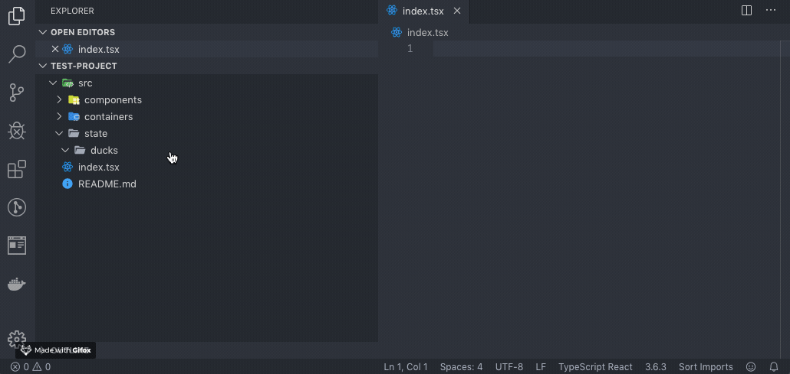

# README

The ducks-typescript-generator is a convenience extension used to automatically generate the a duck structure for your Redux/Typescript project. You can learn more about the ducks structure [here](https://github.com/erikras/ducks-modular-redux).

## Features

The extension will determine if there is a `ducks/` folder within your project and create the requested duck within that folder. If the folder does not exist, the extension will not be able to create the duck.

To begin creating the duck, you can enter `Generate Duck` in the command palette. You will be prompted for the name of the duck, as well as the types you'd like to create.

> Command palette interaction

Once the duck as been generated, browse to that `ducks/DUCKNAME/` folder and start modifying your duck by cleaning up the typescript types associated with the actions, operations, reducers and selectors.

## Extension Settings

Currently the extension doesn't provide any specific customisable settings for the ducks generation.

## Issues and Feature Suggestions

For any issues you may come across using this extension please raise them on [Github Issues](https://github.com/Bespohk/vscode-ducks-typescript-generator/issues).
